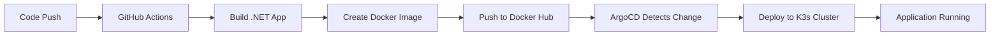

# k3s-simple

A modern mono-repository demonstrating a complete DevOps pipeline for deploying a .NET Core web application to Kubernetes (K3s) using GitOps practices with ArgoCD, Helm charts, and automated CI/CD.

## 📋 Project Description

This project showcases a production-ready setup for containerized .NET applications with:
- **Automated CI/CD**: GitHub Actions pipeline for building and pushing Docker images
- **GitOps Deployment**: ArgoCD for automated Kubernetes deployments
- **Infrastructure as Code**: Helm charts for Kubernetes resource management
- **Lightweight Kubernetes**: K3s-optimized configuration for resource efficiency

## 🚀 Tech Stack

| Technology | Version | Purpose |
|------------|---------|---------|
| **.NET Core** | 10.0 | Web application framework |
| **ASP.NET Core** | 10.0 | Minimal API for HTTP endpoints |
| **Docker** | - | Container runtime for application packaging |
| **Kubernetes (K3s)** | - | Lightweight Kubernetes distribution for orchestration |
| **Helm** | v3 | Kubernetes package manager |
| **ArgoCD** | v1alpha1 | GitOps continuous delivery tool |
| **GitHub Actions** | - | CI/CD automation platform |
| **Docker Hub** | - | Container registry |

## 🔄 Workflow

### CI/CD Pipeline



### Deployment Flow

1. **Development**: Developer pushes code to `main` branch
2. **CI Build**: GitHub Actions triggers automatically
   - Checks out source code
   - Authenticates with Docker Hub
   - Builds Docker image using multi-stage Dockerfile
   - Pushes image with `latest` tag to Docker Hub
3. **GitOps Sync**: ArgoCD monitors the Git repository
   - Detects changes in Helm chart or values
   - Automatically syncs with K3s cluster
   - Applies self-healing and pruning policies
4. **Deployment**: Kubernetes deploys the application
   - Creates/updates deployment with 1 replica
   - Exposes service on port 8080
   - Application serves HTTP requests

## 📁 Project Structure

```
k3s-simple/
├── .github/
│   └── workflows/
│       └── docker-build.yml          # CI/CD pipeline configuration
├── helm/
│   └── hello-k3s/
│       ├── Chart.yaml                # Helm chart metadata
│       ├── values.yaml               # Configuration values
│       └── templates/
│           ├── deployment.yaml       # Kubernetes Deployment manifest
│           └── service.yaml          # Kubernetes Service manifest
├── src/
│   └── HelloK3s/
│       ├── Program.cs                # Application entry point
│       ├── HelloK3s.csproj          # .NET project file
│       ├── appsettings.json         # Application configuration
│       ├── appsettings.Development.json  # Development settings
│       └── Properties/
│           └── launchSettings.json  # Launch profiles
├── argocd-app.yaml                  # ArgoCD Application definition
├── Dockerfile                        # Multi-stage container build
├── .dockerignore                     # Docker build exclusions
├── .gitignore                        # Git exclusions
├── k3s-simple.sln                   # Visual Studio solution file
└── README.md                         # This file
```

## 📄 File Explanations

### Root Directory Files

#### `Dockerfile`
Multi-stage Docker build configuration:
- **Stage 1 (build)**: Uses `dotnet/sdk:10.0` to restore dependencies and compile the application
- **Stage 2 (runtime)**: Uses `dotnet/aspnet:10.0` for a smaller production image
- Exposes port 8080 for HTTP traffic
- Optimized for minimal image size and security

#### `argocd-app.yaml`
ArgoCD Application manifest for GitOps deployment:
- **Purpose**: Defines how ArgoCD should manage the application
- **Source**: Points to GitHub repository and Helm chart path
- **Destination**: Targets the K3s cluster and `hello-k3s` namespace
- **Sync Policy**: 
  - `automated`: Enables automatic synchronization
  - `prune: true`: Removes resources deleted from Git
  - `selfHeal: true`: Automatically corrects manual cluster changes

#### `k3s-simple.sln`
Visual Studio solution file that organizes the .NET project structure for IDE integration.

#### `.dockerignore`
Specifies files and directories to exclude from Docker build context, improving build performance and security.

#### `.gitignore`
Defines files and directories that Git should ignore (e.g., build artifacts, user-specific settings).

---

### `.github/workflows/` Directory

#### `docker-build.yml`
GitHub Actions workflow for automated CI/CD:
- **Trigger**: Runs on every push to `main` branch
- **Steps**:
  1. Checks out repository code
  2. Authenticates with Docker Hub using secrets
  3. Builds Docker image from Dockerfile
  4. Pushes image to `longnguyen29102000/hello-k3s:latest`
- **Secrets Required**: `DOCKER_USERNAME` and `DOCKER_PASSWORD`

---

### `src/HelloK3s/` Directory

#### `Program.cs`
Main application entry point:
- Creates a minimal ASP.NET Core web application
- Defines a single HTTP GET endpoint at root `/`
- Returns message: `"Hello from K3s – mono repo 🚀, new version"`
- Demonstrates lightweight API with minimal configuration

#### `HelloK3s.csproj`
.NET project file:
- **Target Framework**: .NET 10.0
- **SDK**: Microsoft.NET.Sdk.Web for web applications
- **Features**: Nullable reference types, implicit usings enabled
- **Dependencies**: Microsoft.AspNetCore.OpenApi for API documentation

#### `appsettings.json`
Production application configuration file for logging, connection strings, and other runtime settings.

#### `appsettings.Development.json`
Development-specific configuration overrides for local debugging and testing.

#### `Properties/launchSettings.json`
Defines launch profiles for running the application in different environments (IIS Express, Kestrel, Docker).

---

### `helm/hello-k3s/` Directory

#### `Chart.yaml`
Helm chart metadata:
- **Name**: hello-k3s
- **Description**: Mono repo .NET Core + K3s
- **Type**: application
- **Version**: 0.1.0 (chart version)
- **App Version**: 1.0 (application version)

#### `values.yaml`
Configuration values for Helm templates:
- **Image Settings**:
  - Repository: `longnguyen29102000/hello-k3s`
  - Tag: `latest`
  - Pull Policy: `Always` (ensures latest image is fetched)
- **Service Settings**:
  - Port: 8080

#### `templates/deployment.yaml`
Kubernetes Deployment manifest:
- **Replicas**: 1 pod instance
- **Container**: Runs the hello-k3s Docker image
- **Port**: Exposes container port 8080
- **Image Policy**: Uses values from `values.yaml`
- **Labels**: `app: hello-k3s` for service selection

#### `templates/service.yaml`
Kubernetes Service manifest:
- **Type**: ClusterIP (default, internal access only)
- **Port**: 8080 (external port)
- **Target Port**: Routes to container port defined in values
- **Selector**: Matches pods with label `app: hello-k3s`

---

## 🛠️ Usage Commands

### Namespace Management
```bash
# Create namespace
kubectl create namespace hello

# Delete namespace (removes all resources)
kubectl delete namespace hello
```

### Helm Operations
```bash
# Install the application
helm install hello-k3s ./helm/hello-k3s -n hello

# Upgrade the application with new changes
helm upgrade hello-k3s ./helm/hello-k3s -n hello

# List Helm releases in namespace
helm list -n hello
```

### Kubernetes Operations
```bash
# View pods in namespace
kubectl get pods -n hello

# Restart deployment (rolling restart)
kubectl rollout restart deployment hello-k3s -n hello

# Delete all pods in namespace (they will be recreated)
kubectl delete pod -n hello --all
```

### Access the Application
After deployment, the service will be available at:
```
http://<cluster-ip>:8080
```

Use `kubectl port-forward` for local access:
```bash
kubectl port-forward -n hello svc/hello-k3s 8080:8080
```

Then visit: `http://localhost:8080`

---

## 🤝 Contributing

1. Fork the repository
2. Create a feature branch
3. Commit your changes
4. Push to the branch
5. Open a Pull Request

---

## 📝 License

This project is for educational and demonstration purposes.